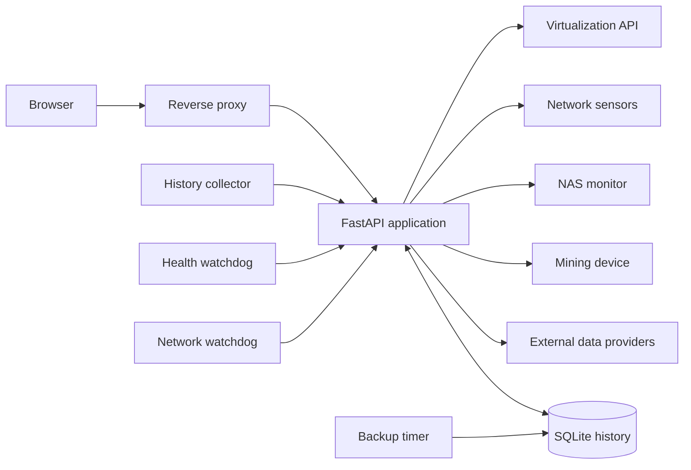

# Surveyor Infrastructure Dashboard

Surveyor is a self-hosted monitoring dashboard for a small virtualization lab and its supporting network devices. It combines host telemetry, virtual-machine state, storage capacity, environmental sensors, network discovery, historical graphs, alerts, weather, market data, and cryptocurrency-miner statistics in a browser-friendly interface.

This documentation is intentionally sanitized for external review. Hostnames, usernames, addresses, credentials, wallet identifiers, and other installation-specific values are represented by neutral roles or placeholders.

## Status

The current deployment is operational on a private network.

- Core dashboard and detail pages are live.
- Historical telemetry is retained in SQLite.
- Health and network-membership watchdogs run through systemd timers.
- The application runs as an unprivileged service account.
- The virtualization API token is audit-only.
- SSH accepts keys only.
- A host firewall limits dashboard and administration access to approved private networks.
- Verified database backups run automatically.

## Features

| Area | Capabilities |
| --- | --- |
| Overview | System health, host utilization, guest summary, collapsible history |
| Virtualization | Node CPU, memory, root storage, uptime, version, VM and container state |
| Sensors | Dashboard-host metrics, hardware temperatures, remote environmental readings |
| Storage | Virtualization storage pools and NAS capacity with pixel-style utilization bars |
| Network | Configured-device inventory and discovery across approved subnets |
| History | One-hour, 24-hour, seven-day, and 30-day graphs with current/minimum/average/maximum values |
| Weather | Current local conditions, day/night treatment, and moon phase |
| Markets | Selected U.S. market, metals, and cryptocurrency indicators |
| Miner | Live hashrate, shares, difficulty, pool status, work completed, and public-chain wallet totals |
| Alerts | Infrastructure warnings and critical conditions |

## Architecture



The web application listens only on loopback. A reverse proxy is the sole HTTP entry point. Remote infrastructure checks use restricted monitoring credentials that can execute only the commands required for observation.

See [docs/ARCHITECTURE.md](docs/ARCHITECTURE.md) for component and data-flow details.

## Technology

- Python and FastAPI
- Uvicorn
- SQLite
- Vanilla HTML, CSS, JavaScript, and Canvas graphs
- Nginx
- systemd services and timers
- nftables
- Restricted SSH monitoring commands

## Repository layout

```text
app/
  main.py             Main API and Overview page
  detail_pages.py     Dedicated dashboard pages
  pve_api.py          Virtualization data adapter
  network_api.py      Network, NAS, sensor, and miner adapters
  history_api.py      SQLite collector and history endpoints
  alerts_api.py       Alert evaluation
  external_api.py     Weather integration
  market_api.py       Market integrations
assets/               Dashboard artwork
deploy/
  systemd/            Service and timer definitions
  nginx/              Reverse-proxy configuration
  firewall/           Sanitized firewall template
scripts/              Backup and watchdog scripts
docs/                 Architecture and operational documentation
project-overview.json Machine-readable project summary
```

The current working deployment predates this ideal public layout. Files should be reorganized and sanitized before publishing source code.

## Configuration

Installation-specific values belong in a protected environment file rather than source code:

```dotenv
VIRTUALIZATION_HOST=https://hypervisor.example.internal:8006
VIRTUALIZATION_NODE=hypervisor-node
VIRTUALIZATION_TOKEN_ID=monitoring-account!dashboard
VIRTUALIZATION_TOKEN_SECRET=replace-with-secret
NAS_HOST=nas.example.internal
MINER_HOST=miner.example.internal
SENSOR_URL=http://sensor.example.internal/api/status
PRIMARY_SCAN_SUBNET=192.0.2.0/24
SECONDARY_SCAN_SUBNET=198.51.100.0/24
SURVEYOR_DB=/var/lib/surveyor/history.db
```

Use documentation-only address ranges in examples. Never commit a populated environment file.

## Security model

- The application uses a dedicated unprivileged account.
- The application filesystem is read-only except for its data directory.
- Service sandboxing blocks privilege escalation, kernel modification, device access, and unsupported socket families.
- The virtualization token grants audit permissions only.
- Remote SSH keys are constrained by forced commands and cannot open a general shell.
- Administrative SSH uses public-key authentication; passwords and forwarding are disabled.
- The firewall allows management and HTTP access only from approved networks.
- Browser responses include framing, content-type, referrer, and permissions protections.
- Secrets use restrictive filesystem permissions.
- Backups are integrity-checked after creation.

Additional policy and disclosure guidance is in [SECURITY.md](SECURITY.md).

## Operations

### Health monitoring

The health watchdog checks the Overview page and critical APIs. If a check fails, it restarts the application, verifies recovery, and records the result.

### Network monitoring

The network watchdog compares currently observed devices with an approved baseline. It records newly detected and missing devices separately for each monitored network.

### History and backups

Telemetry is collected on a schedule and retained for a bounded period. The backup service creates a consistent SQLite backup, validates it, and removes backups older than the configured retention window.

### Logs

Application and watchdog events are stored in the system journal. Logs should be reviewed and redacted before sharing because they can contain internal addresses and device identifiers.

## Public-release checklist

The operational source tree is **not ready to publish unchanged**. Before creating a public repository:

1. Remove all private keys, public-key comments, known-host files, populated environment files, databases, backups, logs, and captured API responses.
2. Rotate any credential that has ever existed in a copied working directory.
3. Replace hardcoded hostnames, usernames, addresses, subnets, wallet identifiers, and node names with configuration variables.
4. Confirm artwork and third-party data-provider licensing permits redistribution.
5. Add automated secret scanning and dependency checks to continuous integration.
6. Test installation from a clean machine using only the example configuration.
7. Review commit history—not only the latest files—for removed secrets or identifiers.

## Roadmap

- Package the application into the public repository layout shown above.
- Move remaining installation-specific constants into configuration.
- Add automated tests for adapters, history retention, and alert thresholds.
- Add a documented restore test for database backups.
- Optionally enable trusted internal HTTPS and authentication.
- Maintain a powered-off clone or template for disaster recovery.

## License

No license has been selected. External reviewers may inspect this documentation, but source reuse is not granted until a license is added.

