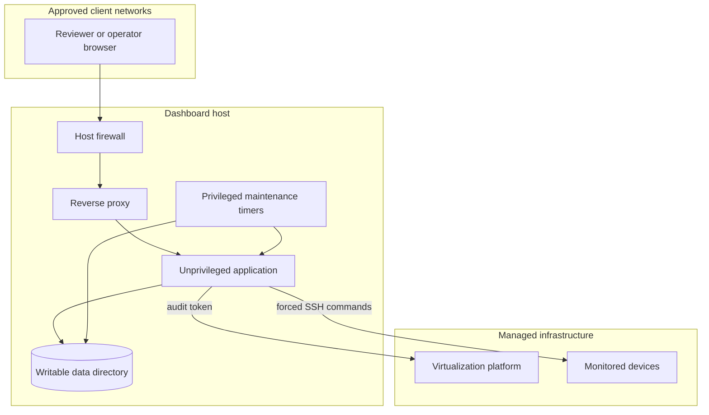

# Architecture

## Design goals

Surveyor is designed to keep local infrastructure monitoring useful even when individual devices or external providers are unavailable. Core monitoring remains local, read-only, and independent of weather or market services.

## Components

### Web application

The FastAPI application serves JSON endpoints and the browser interface. It binds to loopback and is reached through a reverse proxy. Dashboard pages use plain JavaScript and Canvas, which keeps the runtime small and avoids a frontend build toolchain.

### Infrastructure adapters

Adapters translate source-specific data into small dashboard responses:

- The virtualization adapter reads node, guest, and storage status through an audit-only API token.
- The network adapter reads configured devices and performs bounded discovery on approved subnets.
- The NAS adapter invokes a restricted disk-capacity command over SSH.
- The secondary-network adapter invokes a restricted discovery command on the network gateway.
- The miner adapter reads local telemetry and obtains wallet totals from a public blockchain data source.
- External adapters supply weather and market data without participating in core health decisions.

### History

The history component periodically requests normalized local endpoints and stores timestamped values in SQLite. It exposes bounded query ranges for graphs and removes records older than the retention policy.

### Watchdogs

The health watchdog checks critical pages and APIs, restarts the service after failure, and writes a structured status file. The network watchdog compares discovery results with a fixed baseline and records new or missing devices.

### Backup

A systemd timer invokes SQLite's safe backup mechanism. Each backup is checked before being accepted. Old backups are removed according to retention policy.

## Trust boundaries

The browser is untrusted input, the dashboard service is unprivileged, and managed systems expose only observation capabilities. Maintenance actions such as restart and backup remain in separate root-owned services.

## Data classification

| Data | Sensitivity | Publication rule |
| --- | --- | --- |
| CPU, memory, storage percentages | Operational | Aggregate examples only |
| Internal hostnames and addresses | Private infrastructure | Replace with placeholders |
| API tokens and SSH keys | Secret | Never publish |
| Wallet identifier and balance | Financial identifier | Never publish without explicit approval |
| Discovered-device inventory | Private infrastructure | Never publish raw output |
| Weather location | Personal location | Generalize or omit |
| Logs and databases | Potentially sensitive | Redact or use synthetic fixtures |

## Failure behavior

- A source timeout affects its card rather than blocking the entire dashboard.
- External-provider failures do not change core infrastructure health.
- Network discovery results are cached to avoid repeated full scans.
- Blockchain totals are cached and displayed as unavailable when the provider cannot be reached.
- Missing history is displayed explicitly rather than drawn as a fabricated value.
- The health watchdog performs one controlled restart and records whether recovery succeeded.

## Deployment assumptions

- Linux host with systemd
- Reverse proxy installed locally
- Python virtual environment under the application directory
- SQLite data on persistent storage
- Private DNS or local name resolution
- Explicit network allowlist at the host firewall
- Time synchronization enabled

